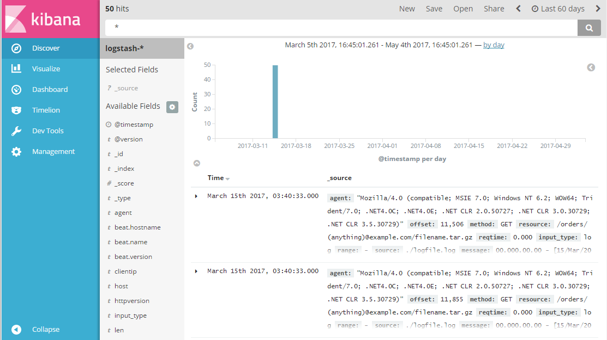

Logstash provides the ability to parse NGINX server logs. 

* [Logstash](https://www.elastic.co/guide/en/logstash/current/docker.html)
  * [Filebeats](https://www.elastic.co/guide/en/logstash/current/plugins-inputs-beats.html)
* [Elasticsearch](https://www.elastic.co/guide/en/elasticsearch/reference/current/docker.html)
* [Kibana](https://www.elastic.co/guide/en/kibana/current/docker.html)

## Dependencies

* Docker 1.13
* Docker Compose 1.10

## Startup


Startup the multi-container architecture using:

```bash
docker-compose up -d [--build]
```

The results can then be queried with: 
```bash
$ curl -s 'localhost:9200/logstash-*/_search?pretty&size=1' | head
```
```json
{
  "took" : 2,
  "timed_out" : false,
  "_shards" : {
    "total" : 5,
    "successful" : 5,
    "failed" : 0
  },
  "hits" : {
    "total" : 50,
```

Once Kibana is done "Optimizing", it will log: `"message":"Server running at http://0:5601"`,
then, navigate to [Kibana Dashboard](http://localhost:5601/app/kibana)




## References

* [Config grok](https://www.elastic.co/guide/en/logstash/5.2/plugins-filters-grok.html)
* [Grok Patterns](https://github.com/elastic/logstash/blob/v1.4.2/patterns/grok-patterns)
* [Grok matching tool](http://grokconstructor.appspot.com/do/match)
* [Elastic Search API](https://www.elastic.co/guide/en/elasticsearch/reference/1.4/search.html)

